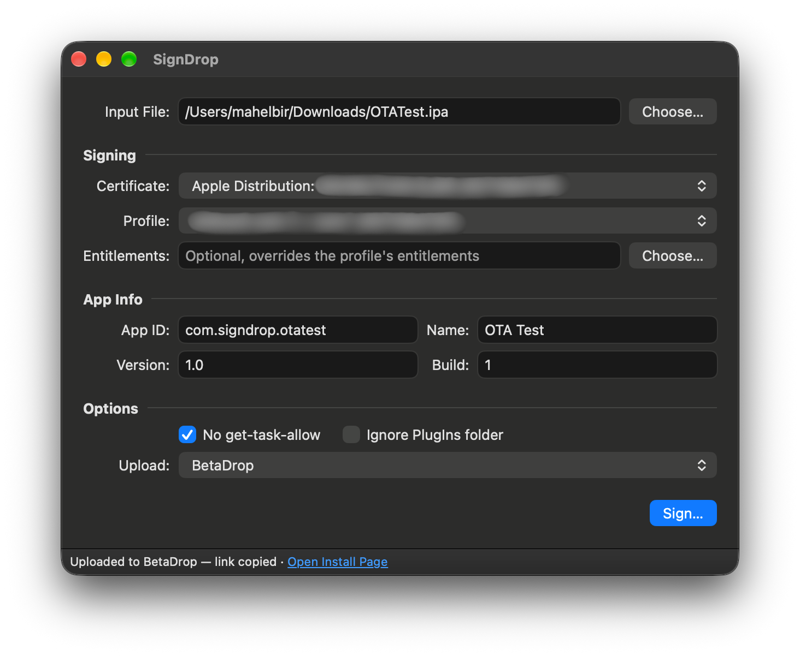

# SignDrop

[](https://github.com/mahelbir/signdrop/releases)
[](LICENSE.txt)

A macOS app that re-signs iPhone and iPad apps with your own certificate and provisioning profile, and shares the signed IPA as an
install link.



## Features

- Re-signs iOS and iPadOS apps from `.ipa`, `.app`, `.appex` and `.xcarchive` files, jailbreak `.deb` packages that contain an
  app, or an IPA URL
- Uses any signing certificate in your Keychain with an installed or custom provisioning profile
- Overrides the profile's entitlements with your own file
- Changes the App ID, display name, version and build before signing
- Signs extensions, frameworks and libraries inside out, then verifies the result
- Uploads the signed IPA and provides the installation link

## How to Install

### Download

Download the latest `.dmg` from [Releases](https://github.com/mahelbir/signdrop/releases), open it and drag
**SignDrop** into **Applications**.

### Build from Source

```bash
git clone https://github.com/mahelbir/signdrop.git
cd signdrop
scripts/run.sh
```

`scripts/run.sh` builds a Debug copy with Xcode and launches it.

> **Note:** SignDrop needs macOS 12 or later and the Xcode command line tools to build.

## Uploads

| Service     | Account                               | Link                                     |
|-------------|---------------------------------------|------------------------------------------|
| BetaDrop    | Required, sign in from SignDrop       | BetaDrop install page                    |
| StreamShare | Not needed                            | Short link that opens the install prompt |

**BetaDrop** signs you in through your browser, or with a pasted API token. SignDrop shares its session with the
[BetaDrop CLI](https://github.com/betadrop-app/betadrop-cli), so signing in to one signs in the other. Sign out from
the app menu.

**StreamShare** uploads the IPA and an install manifest, then builds a short link. Open the link in Safari on an iPhone or
iPad listed in the provisioning profile to install the app.

> **Important:** StreamShare uploads are public to anyone with the link. Click **Delete Upload** in the status bar to
> remove them.

## How to Update

SignDrop checks [Releases](https://github.com/mahelbir/signdrop/releases) and opens the release page when a new
version is out. If you build from source, pull the latest changes and run `scripts/run.sh` again.

## Credits

SignDrop is based on [iOS App Signer](https://github.com/DanTheMan827/ios-app-signer) by Daniel Radtke. BetaDrop uploads
follow the official [BetaDrop CLI](https://github.com/betadrop-app/betadrop-cli).

Install links are hosted by [StreamShare](https://streamshare.wireway.ch), turned into web links by
[Urlmskr](https://axorax.github.io/urlmskr/), and shortened by [Ulvis](https://ulvis.net),
[Spoo.me](https://spoo.me), [CleanURI](https://cleanuri.com) or [TinyURL](https://tinyurl.com), tried in that order.
SignDrop is not affiliated with these services.

## Support

If this project helps you, please consider giving it a [Star ⭐️](https://github.com/mahelbir/signdrop) on GitHub.
This will encourage us to continue developing and maintaining this project.
